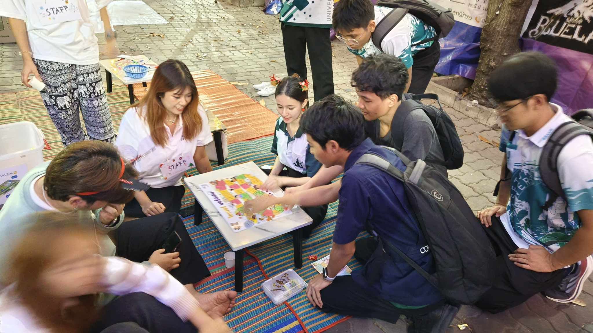
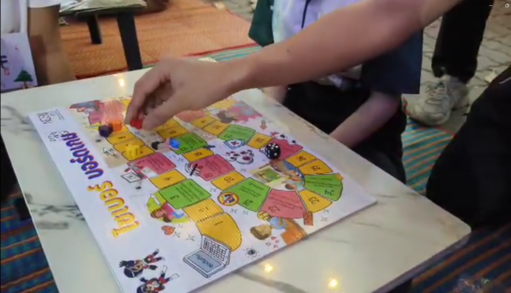

# Board Game 
________________________________________________________________________________________
## Group : Kraprao Mhookrob Kaidao 

### รายละเอียดของกิจกรรม
กิจกรรมนี้จัดขึ้นโดยกลุ่ม "Kraprao Mhookrob Kaidao" ซึ่งเป็นนิสิตสาขา Computer Science โดยใช้บอร์ดเกมของสำนักงานคณะกรรมการการรักษาความมั่นคงปลอดภัยไซเบอร์ (สกมช.) เพื่อสร้างความตระหนักรู้และเสริมสร้างทักษะด้านการรักษาความมั่นคงปลอดภัยไซเบอร์ให้กับเด็กและเยาวชน

ในกิจกรรมนี้ กลุ่มของเราได้คัดเลือกผู้ที่สนใจในการเข้าร่วมเล่นบอร์ดเกม และได้รับอนุญาตจากผู้เข้าร่วมในการถ่ายวิดีโอเรียบร้อยแล้ว โดยผู้เข้าร่วมกิจกรรมประกอบด้วยผู้เล่นทั้งหมด 4 คน (ผู้เล่น 2 คน และสมาชิกในกลุ่ม 2 คน) ในระหว่างทำกิจกรรมได้มีการพูดถึงกฎหมายต่าง ๆ ที่เกี่ยวข้องกับบอร์ดเกม

การถ่ายทำกิจกรรมดังกล่าวจัดขึ้นเมื่อวันที่ 21 ธันวาคม 2566 เวลาประมาณ 19.00 น. ณ บริเวณ ตึก 9 มหาวิทยาลัยเกษตรศาสตร์ วิทยาเขตศรีราชา

### บรรยากาศกิจกรรม (Video)

### เพื่อนร่วมอุดมการณ์

1. [Amarin Yaowarod](https://6530200908.github.io/)

2. [Panupong Thondcherd](https://6530200339.github.io/)

3. [Kasidid Yookong](https://kasidid-y.github.io/)

4. [Suphanimit Nilchawee](https://6530200517.github.io/)

[my profile](https://ุ6530200517.github.io/)
